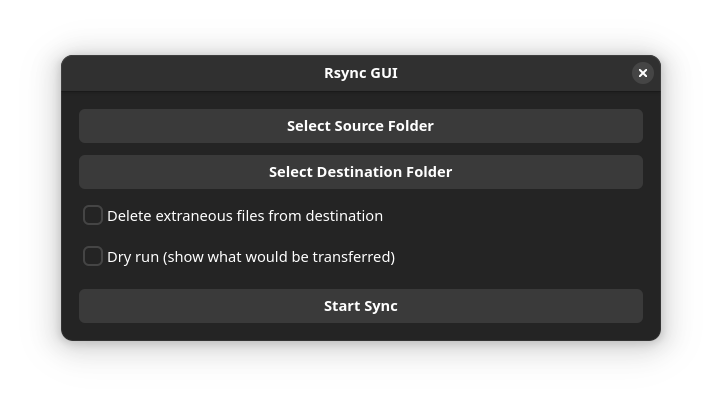

# Rsync GUI

A simple GTK4-based graphical user interface for rsync, making it easy to synchronize directories with a visual interface.




## Features

- Select source and destination directories through a graphical interface
- Option to perform a dry run to preview changes
- Option to delete extraneous files from the destination
- Real-time output display of rsync operation
- Simple and intuitive interface

## Prerequisites

To build and run Rsync GUI, you need:

- GTK 4 development libraries
- Meson build system
- Ninja build system
- A C compiler (gcc or clang)
- rsync

### Ubuntu/Debian

```bash
sudo apt install build-essential meson ninja-build libgtk-4-dev rsync
```

### Fedora

```bash
sudo dnf install gcc meson ninja-build gtk4-devel rsync
```

### OpenSUSE

```bash
sudo zypper install gcc gcc-c++ meson ninja gtk4-devel rsync
```

### Arch Linux

```bash
sudo pacman -S base-devel meson ninja gtk4 rsync
```

## Building from Source

1. Clone the repository:
```bash
git clone https://github.com/yourusername/rsync-gui.git
cd rsync-gui
```

2. Create a build directory and configure the project:
```bash
meson setup build
```

3. Build the project:
```bash
ninja -C build
```

4. Install (optional):
```bash
sudo ninja -C build install
```

## Usage

1. Launch the application:
```bash
./build/rsync-gui
```

2. Click "Select Source Folder" to choose the directory you want to copy from
3. Click "Select Destination Folder" to choose where you want to copy to
4. Optional: Check "Dry run" to preview what would be transferred
5. Optional: Check "Delete extraneous files" to remove files in the destination that don't exist in the source
6. Click "Start Sync" to begin the synchronization

The text area at the bottom will show the progress and results of the rsync operation.

## How It Works

The program creates a graphical interface for the rsync command-line tool. When you click "Start Sync", it constructs an rsync command with the following options:

- `-av`: Archive mode with verbose output
- `--dry-run`: (Optional) Show what would be transferred
- `--delete`: (Optional) Delete extraneous files from destination directory

## License

This project is licensed under the GNU General Public License v3.0 (GPLv3). See the [LICENSE](LICENSE) file for details.

## Contributing

Contributions are welcome! Please feel free to submit a Pull Request.

## Security Notes

- The program runs rsync with your current user permissions
- Always verify the paths and options before starting a sync, especially when using the delete option
- Use dry run first if you're unsure about the changes that will be made

## Acknowledgments

- Built with GTK 4
- Uses rsync for reliable file synchronization
